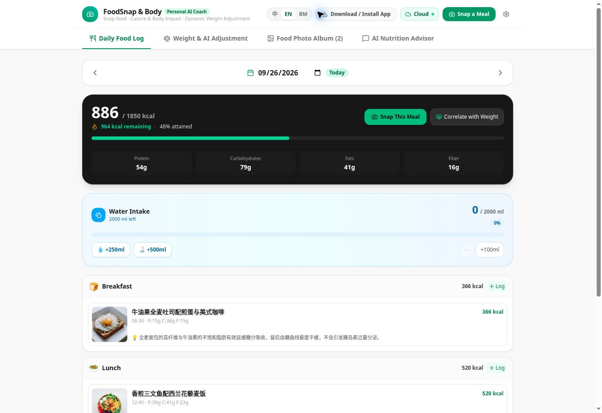

# FoodSnap & Body

**A personal food photo journal and body-trend dashboard.**

[Open the live preview](https://ais-pre-dsrhuffgag43w67cmsxg43-69964347795.asia-east1.run.app/) · [Esther's GitHub](https://github.com/assumie)

**Public preview · README only · Application source not published yet**  
**公开预览版 · 本仓库目前只有项目介绍，应用源码暂未公开**

*Live interface preview. Meal entries shown are from the public preview. / 公开预览画面中的餐食记录仅供展示。*

## Why I started it / 为什么做这个

I wanted to remember what I ate through photos, see meals by breakfast, lunch, and dinner, and compare estimated nutrition with my weight trend. The design keeps the photo and the context together, while leaving room to correct uncertain AI estimates.

我想用拍照的方式记录三餐，保留食物照片，同时观察大概的热量与营养，以及体重随时间的变化。AI 的辨识结果应该可以人工修改，不应被当成绝对准确的数据。

## The idea

A meal is easier to remember when its photo stays with the record. FoodSnap & Body brings meal photos, estimated nutrition, daily eating patterns, hydration, and weight trends into one place. It began as a tool for my own day-to-day use.

## What you can explore in the preview

| Area | What it shows |
| --- | --- |
| Meal journal | Breakfast, lunch, dinner, and snack entries with photos, times, and estimated calories. |
| Daily overview | Calorie and nutrient summaries, plus a hydration tracker. |
| Food gallery | A visual history of logged meals. |
| Body trends | Weight history and a place for adjusting personal goals over time. |
| Languages | Chinese, English, and Bahasa Melayu options in the interface. |

### Try the flow

1. Open the [live preview](https://ais-pre-dsrhuffgag43w67cmsxg43-69964347795.asia-east1.run.app/).
2. Explore the meal journal and photo gallery.
3. Open **拍照记一餐** to see the meal-capture flow.
4. Visit the weight-trend and nutrition sections.

> Nutrition values and photo-based interpretations are estimates. Portions, oils, sauces, and hidden ingredients can change the result. This project is for personal tracking, not medical advice.

## Design goals

- **Photo first:** make a meal recognizable at a glance.
- **Small daily steps:** keep logging quicker than writing a full diary.
- **Human review:** present AI suggestions as editable estimates, never precise facts.
- **Personal by default:** the public project page does not contain private food photos or weight records.

## Project status

This repository documents the **public preview**. The preview URL is temporary and may change. The application source code is **not published in this repository yet**, so there are no local setup instructions or test commands to claim here. I will add the implementation and technical notes when a public release is ready.

Built and designed by **Esther Lee Qian Hui**.
